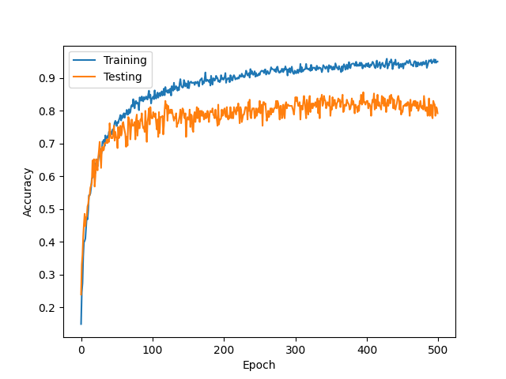
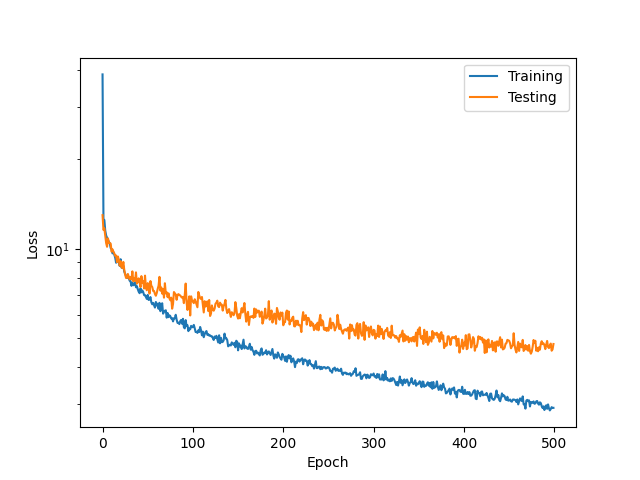
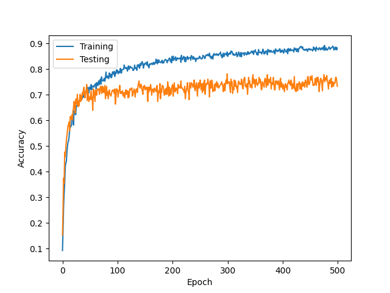
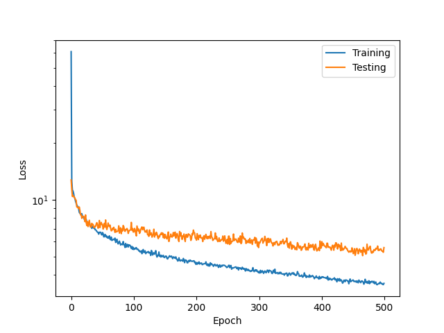

# dvs_hand_gesture_classification
 Dataset and Codes for DVS Hand Gesture Recognition under Diverse Lights


## Installation

Following packages are required. Please refer to requirements.txt. 

```bash
    SLAYER
    Anaconda
    Pytorch
    Numpy
    Matplotlib
```
    
## Dataset
The original dataset could be accessed from the following Google Drive link.


Videos Only
- Samples are named as gesture_name_lighting
- 2 hand gestures: hand wave and hand rotation
- 3 lighting condition: roomlight, dim, natural
```bash
    https://drive.google.com/drive/folders/1_JGur1xpL0lK0lABGcnYWWxNXMqSdJJ6?usp=sharing
```

All Dataset
- Contains the .avi (video), .npy (numpy file), .raw (raw recording from DVS) and the CSV label file (listing the start and end times, and the class label) for each sample
```bash
    https://drive.google.com/drive/folders/1P_Iq3HcVa-9JfECthHhNv1HmhR7EfmIJ?usp=sharing

```

## Dataset Augmentation
- Scaling (cropping 400x300 off higher resolutions)
- Eventdrop
- Rotate
etc. 

## Probing
Contains the codes to probe the intermediate results as well as the gif pictures for selected sample as a demonstration

## Training
Contains an example of the model training procedures. The paths needs to be modified accordingly and the dependency needs to be pre-installed. 

### Training Result (IBM)



### Training Result (IBM)



## Inference
Contains the code to perform inference based on the network model obtained from training. Paths needs to be modified. 